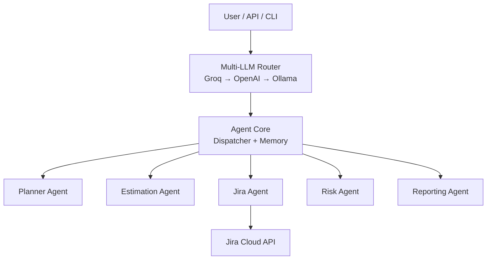

<p align="center">
  
</p>

<h1 align="center" style="color:#004AAD;"><b>HCS PMO - AgenticAI</b></h1>

<p align="center" style="color:#000000;">
<b>Enterprise-Grade AI Assistant for Project, Program & Portfolio Management</b>
</p>

<hr style="border:1px solid #FDBF00;">

## 🚀 What Is HCS PMO - AgenticAI Suite?

An enterprise-grade agentic AI system built to automate:

✔ Sprint Planning

✔ Estimation

✔ Jira/ADO workflows

✔ Risk detection

✔ PM reporting

✔ Resource forecasting

✔ Project documentation

### Powered by:

•	Groq (ultra-fast inference)

•	OpenAI (deep reasoning)

•	Ollama (offline LLM execution)

________________________________________
## 🧠 System Architecture



________________________________________

## 🌟 Key Features

### 🔀 Multi-LLM Routing

Groq → OpenAI → Ollama fallback ensures:

•	Zero downtime

•	Cost optimization

•	High reasoning accuracy

•	Fully offline mode

### 🤖 Modular Agents

•	Planner Agent

•	Estimation Agent

•	Risk Agent

•	Reporting Agent

•	Jira Agent

•	ADO Agent (Coming Soon)

### 🔌 Integrations

•	Jira Cloud

•	Azure DevOps

•	Slack

•	MS Project

•	Email (Outlook/SMTP)

### 📊 Reporting

•	PDF

•	PowerPoint

•	Excel

•	Burndown charts

•	Custom dashboards

## 🛠 Installation

```bash
git clone https://github.com/BhaskarHCS/AgenticAI-for-PMs.git
cd AgenticAI-for-PMs/services/agent-core
pip install -r requirements.txt
```bash

## Environment Variables

```bash
OPENAI_API_KEY=
GROQ_API_KEY=
OLLAMA_BASE_URL=http://localhost:11434
JIRA_API_TOKEN=
JIRA_EMAIL=
JIRA_URL=
```

## 💡 Quickstart Example

```bash
from agent import llm_route

response = llm_route("Create a sprint plan for mobile app backend")
print(response)
```

## 📚 Full Documentation

👉 See the full wiki here:

https://github.com/BhaskarHCS/AgenticAI-for-PM-s/wiki

## 🛣 Roadmap (2025–2027)

✔ Multi-LLM routing

✔ Core agents (Planner, Estimation, Risk)

✔ Reporting engine

⬜ Confluence publishing agent

⬜ MS Project full import/export

⬜ Autonomous PM mode

⬜ SSO + RBAC enterprise version


Full roadmap → [[[Roadmap]](https://github.com/BhaskarHCS/AgenticAI-for-PM-s/wiki/Roadmap)].

## 📩 Support

Email: operations@hcsbharath.com

Company: HCS — Hamrith Consulting Service LLP
